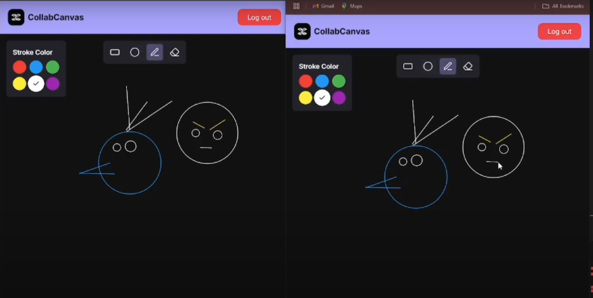

# 🖌️ CollabCanvas – Real-Time Excalidraw Clone

> A real-time collaborative whiteboard where users can create and share drawing rooms with friends to sketch, draw shapes, and brainstorm ideas together — just like Excalidraw!

---

## 🛠️ Tech Stack

**Monorepo:** Turborepo  
**Frontend:** Next.js, Tailwind CSS  
**Backend (API):** Express.js  
**Real-Time:** WebSockets (`ws`)  
**ORM:** Prisma  
**Database:** PostgreSQL

---

## 🌐 Live Demo

🎨 [CollabCanvas Demo](./demo.mp4)

📸 Screenshots

---

## 🚀 Features

- 🧑‍🤝‍🧑 Create and share collaborative canvas rooms
- ✏️ Draw and edit shapes: rectangles, circles, triangles, lines
- 🌈 Change colors, sizes, and border styles
- 🧽 Erase shapes using an intuitive eraser tool
- 💬 Real-time drawing updates across users using WebSockets
- 📱 Fully responsive and clean UI
- 🖇 Built with a scalable monorepo (Turborepo)

---
